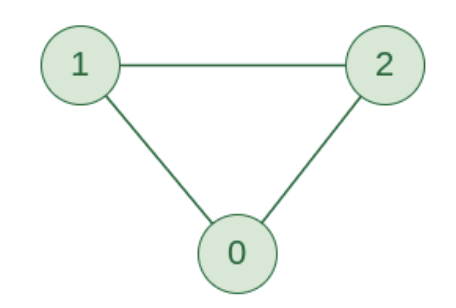

# Graphs



## Adjacency Matrix
```
[
  [0, 1, 1]
  [1, 0, 1]
  [1, 1, 0]
]
```
#### Big O
- add vertex - O(v^2^)
- add edge - O(1)
- remove vertex - O(v^2^)
- remove edge - O(1)
- query - O(1)
- storage - O(v^2^)

#### Pros
- faster to look up specific edge
#### Cons
- Takes up more space (in sparse graphs)
- Slower to iterate over edges

## Adjacency List
```
[
  [1, 2],
  [0 ,2],
  [0, 1]
]
```
#### Big O
- add vertex - O(1)
- add edge - O(1)
- remove vertex - O(v + e)
- remove edge - O(e)
- query - O(v + e)
- storage - O(v + e)

#### Pros
- can take up less space (in sparse graphs)
- faster to iterate over all the edges
#### Cons
- Can be slower to look up a specific edge


