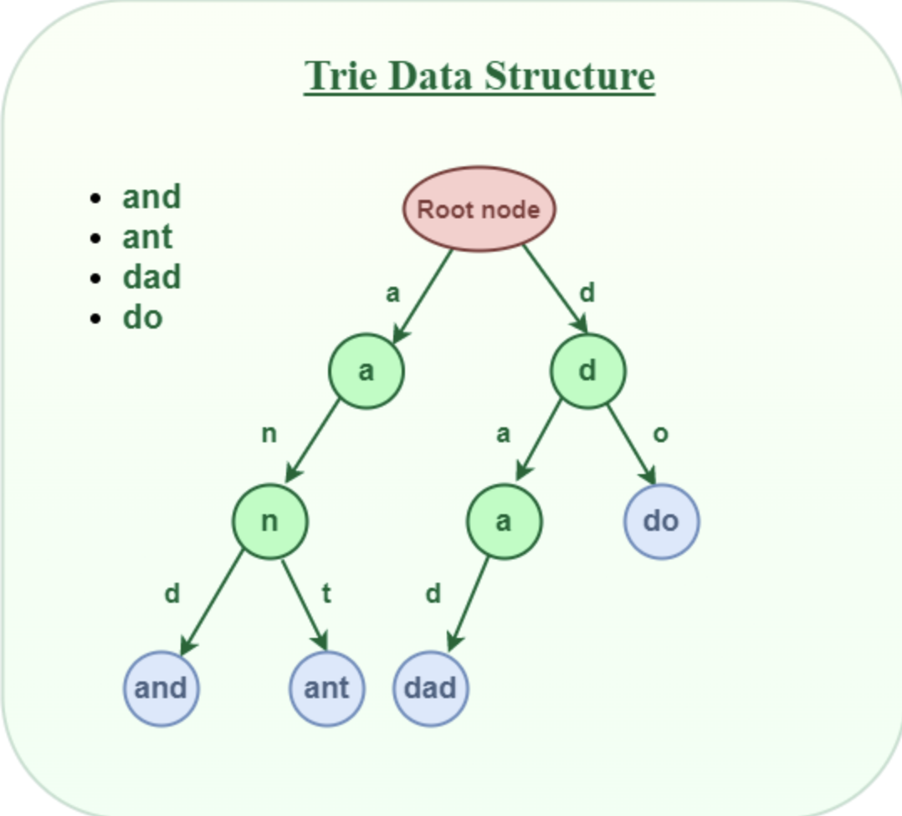

# Tries
A type of tree where every node represents a letter and every leaf of a branch represents a word with the prefix of all its nodes that come before it in the branch

- note the root node stays null
