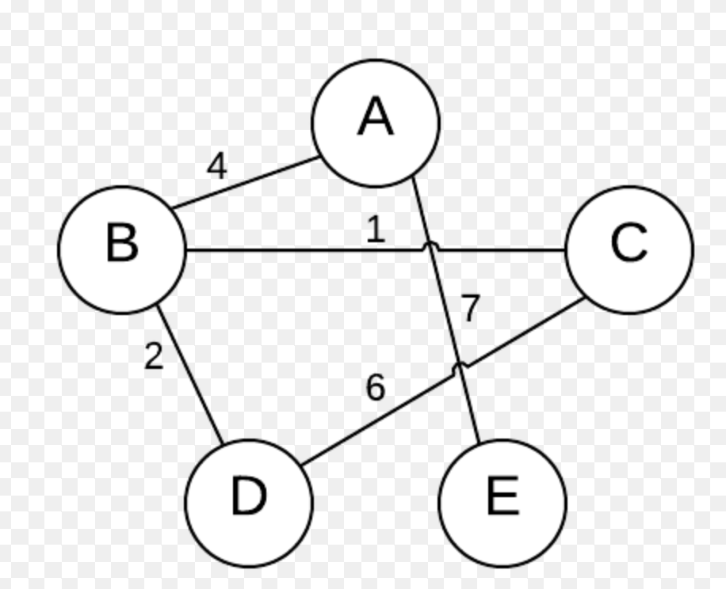

# Dynamic Programming
Used for problems in which there are **overlapping subproblems** and **optimal substructure**

## Overlapping Subproblems
A problem is said to have overlapping subproblems if it can be broken down into subproblems which are reused several times. Just having subproblems is not enough, they must be *overlapping*.
Examples of *overlapping* subproblems:

- fibonacci sequence:
  - to solve nth el of a fibonacci sequence of `fib(5)`, you must calculate `fib(4)` and `fib(3)`. To solve `fib(4)`, you must calculate `fib(3)` and `fib(2)`... here we have *overlapping* subproblems

Examples of *non-overlapping* subproblems:
- `mergeSort`: to sort `[5, 3, 2, 4]` you break it down into `[5, 3]` and `[2, 4]` and then `[5]`, `[3]`, `[2]`, `[4]`, solve those and then combine. These subproblems do NOT overlap

## Optimal Substructure
A problem is said to have optimal substructure if an optimal solution can be constructed from optimal solutions of its subproblems.
Example of *optimal substructure*:

- Solving the optimal path between A and D can be found by solving the optimal path between A and B and then B and D

Example of *non-optimal substructure*:

- The cheapest flight from SFO -> FAI is with a stopover in SEA so SFO -> SEA -> FAI
- You cannot intuit that the shortest flight to from SFO -> FAI is therefore SFO -> FAI because in fact that cheapest flight is SFO -> PDX -> SEA

## Top-Down
- like fibonacci where we start with `fib(n)` and work down to `fib(2)`

## Bottom-Up
### Tabulation
- storing the result of a previous result in a "table" usually an array
  - this is usually done using iteration
  - better space complexity can be achieved using tabulation
