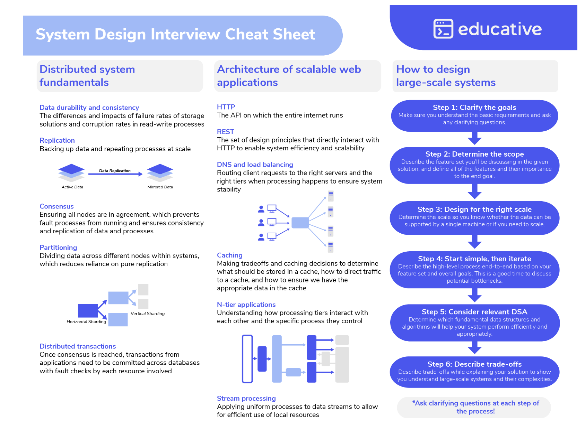
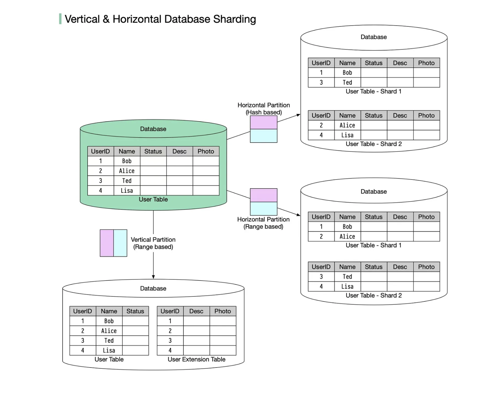
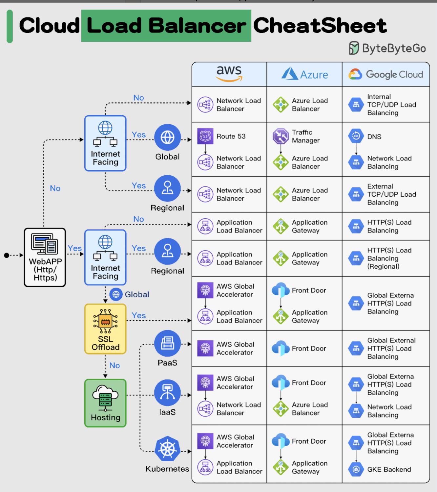

# System Design

## Concepts

### Increase in Users

- **Vertical scaling** - add more cpu / ram
- **Horizontal scaling** - replica servers, routed between using a load balancer
  - How to choose which server
    - Round robin - each user gets routed to the next server
    - Hashing to determine which server a user gets routed to

### CDN's

- copy static files from your server to CDN servers so users can read from the closest CDN server

### Caching

- copy of information stored for fast fetching

### Internet stuff / communication between computers

- **DNS** - translate a domain to its IP address (A records)
- **HTTP** - built on top of TCP / IP so we don't have to worry about reassembling packets
  - Contains a request header (address / meta info etc)
  - Request body (contents)
- **API paradigms**
  - **REST** - stateless, consistent
  - **GraphQL** - query for as many resources as you want, with all the fields you need
- **Polling** - periodically check to see if there are any new messages / new data
  - **Long Polling**- client sends request, server responds to request (incompletely), client sends new request to get next piece of data
  - **Short Polling** - client makes requests at timed intervals. This means sometimes, the client will poll and no new data will be returned
- **Web Sockets** - _Bi-directional_ communication, when you send a message to the server, the server immediately sends the message to the other device

### Storing Data

- **Relational Databases**
  - **Pros**
    - **ACID** compliant
      - **A**tomicity - every transaction is all or nothing, aka if only some part of a transaction happens, the whole thing doesn't happen
      - **C**onsistency - foreign key and other constraints will always be enforced (the main thing no-sql DB's doesn't have)
      - **I**solation - different concurrent transactions won't interfere with each other
      - **D**urabilty - data is stored on disk so even if a machine restarts, it is guaranteed to be there
    - **Cons**
      - Scalability - historically meant to be run on a single machine (because cross-instance joins become very expensive), which limits data size increases or increases in frequency
      - Flexibility - schemas are rigid
      - Performance - as the complexity of the tables increase, the time it takes to perform queries increases
  - Examples: MySQL, Postgres
- **No-SQL Databases**
  - **Pros**
    - You can store multiple layers of data about a collection in the same record e.g. in a Customers document, you can nest a customer's orders all in the same document
    - No schema (necessarily) so you can store different data in documents as needed (some orders may have a description field, others may not)
    - **Sharding** (distributing data between instances) is much simpler because all data related to a record is stored in the same document (no need to join between instances)
  - Examples:
    - **Document Store** (MongoDb)
      - Middle ground between relational and key-value
      - Data stored in documents, usually JSON-like structures
      - You can enforce some level of of structure within the documents (and then therefore index on certain fields)
    - **Key-Value Store** (DynamoDB)
      - Data is stored as keys and values
      - When retrieving values by their keys, you know nothing about what the value looks like
      - This allows for very fast reads and writes
- **General Concepts**
  - **Sharding** - different data is stored in different instances to increase scalability
    - Every row could have a _shard key_ to identify which shard it is on
      - There is usually a separate service to determine which shard a piece of data is on (adds additional latency)
    - Good for both increased reads and writes
  - **Replication** - leader / follower model, reads can be distributed among followers, writes all go to leader which then copies to followers
    - Excellent for read heavy requirements
  - **Read Heavy** - eventual consistency is good enough
  - **Write Heavy** - favor consistency

### Message Queues

- Introduce a queue so you can store actions and complete a request before they are run
- Allows different parts of a system to be _decoupled_ because each part can add to the same queue
- Used to send the _same_ message to different consumers
- Immediate
- Example: **SQS**
- To limit messages processed in the queue at any given time, you can build a Lambda function configured to process messages from the SQS queue, and set a concurrency limit on the Lambda function to limit the number of simultaneous executions

### Pub / Sub

- Exmaple: **SNS**
  - Distributed pub/sub solution
  - Producers publish messages to topics, consumers subscribe to topics to receive messages
  - Used to send different messages to different consumers

